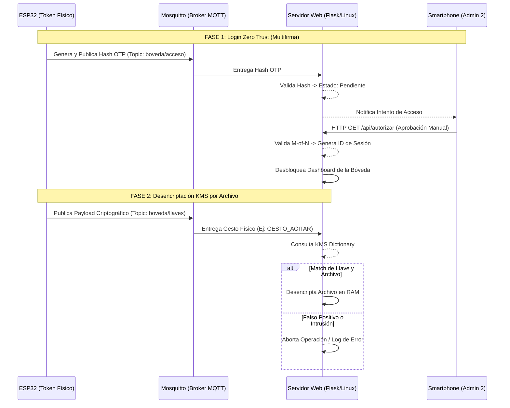
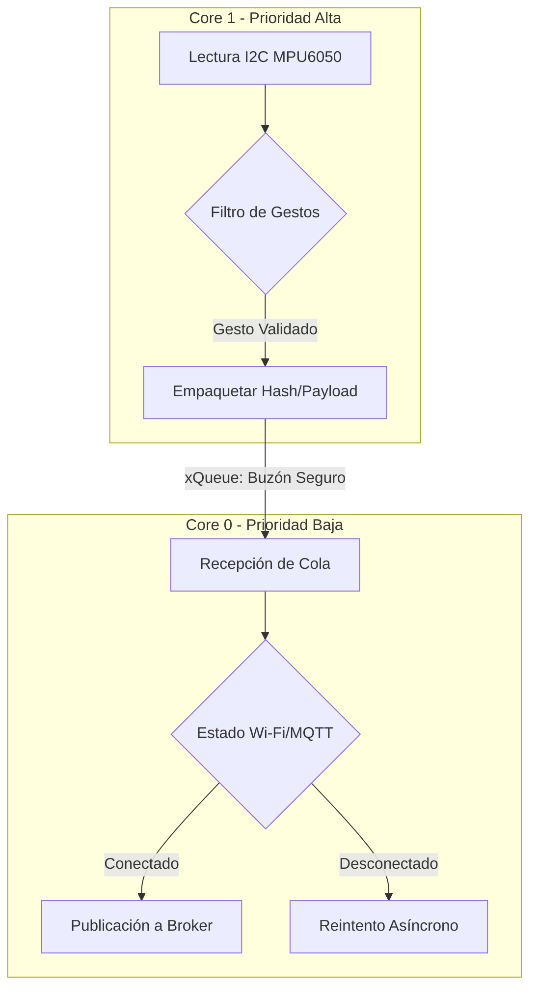

#  PROYECTO IoT

**Sistema de Gestión de Llaves (KMS) con Autenticación Física 2FA y Arquitectura Zero Trust.**

Un proyecto Full-Stack de seguridad informática y sistemas embebidos. Combina criptografía, telemetría de sensores en tiempo real (FreeRTOS), redes locales (MQTT) y desarrollo web (Flask) para crear una bóveda de archivos blindada contra accesos físicos y lógicos no autorizados.

Vídeos muestra del funcionamiento del proyecto:
https://drive.google.com/drive/folders/16WSvXWd0N8RQQljvbggiRwc9IMhkvlaS?usp=sharing


---

##  Características Principales

1. **Autenticación Física de Doble Factor (2FA):** El acceso principal requiere un Token de Hardware (ESP32) y la ejecución de un "Gesto Maestro" tridimensional validado por una IMU de 6 grados de libertad.
2. **Arquitectura Zero Trust:** Separación estricta de privilegios. El Token inicia la solicitud mediante un Hash OTP, pero el acceso final requiere **Autorización de Múltiples Partes (M-of-N)** a través de un dispositivo móvil independiente.
3. **Procesamiento Dual-Core (FreeRTOS):** El firmware del ESP32 está diseñado para cero latencia. Un núcleo del microprocesador se dedica exclusivamente a leer el bus I2C del sensor, mientras el otro gestiona la pila TCP/IP y MQTT de forma asíncrona.
4. **KMS Dinámico (Key Management System):** El backend en Python permite cifrar archivos nuevos desde la interfaz web, asignándoles gestos físicos específicos como llaves de desencriptación en RAM.

---

##  Estructura del Proyecto

El repositorio está dividido en microservicios y módulos de hardware para facilitar su despliegue y mantenimiento:

```text
KMS-Zero-Trust-Auth/
├── 📁 src/
│   ├── 📁 esp32_token/           # Firmware del microcontrolador
│   │   └── esp32_token.ino       # Código fuente C++ (FreeRTOS & MQTT)
│   └── 📁 servidor_uno_q/        # Backend, Frontend y Criptografía
│       ├── requirements.txt      # Dependencias de Python
│       └── servidor_kms.py       # API Flask y Lógica MQTT
├── Dockerfile                    # (Opcional) Contenedor del backend Flask
├── docker-compose.yml            # (Opcional) Orquestador con Mosquitto MQTT
└── README.md                     # Documentación principal

```

---

##  Arquitectura del Sistema

El siguiente diagrama detalla el flujo de información y la separación de capas de red.



---

##  Arquitectura de Firmware (FreeRTOS)

Para garantizar la lectura ininterrumpida de los sensores, el microcontrolador implementa tareas paralelas comunicadas mediante colas de mensajes (`xQueueSend` / `xQueueReceive`), evitando colisiones de memoria.



---

##  Hardware y Esquemático

El Token requiere un circuito minimalista. El botón pulsador utiliza la resistencia Pull-Up interna del ESP32 (`INPUT_PULLUP`), reduciendo el ruido electrónico y la cantidad de componentes.

| Componente | Pin Físico | Pin ESP32 | Función del Bus |
| --- | --- | --- | --- |
| **MPU6050** | VCC | 3.3V | Alimentación lógica |
| **MPU6050** | GND | GND | Tierra común |
| **MPU6050** | SCL | GPIO 22 | Reloj I2C (Inter-Integrated Circuit) |
| **MPU6050** | SDA | GPIO 21 | Datos I2C |
| **Push Button** | Terminal 1 | GPIO 4 | Selector de Estado (Master Login) |
| **Push Button** | Terminal 2 | GND | Cierre de circuito |

---

##  Despliegue e Instalación

### Requisitos Previos

* Un servidor local (Raspberry Pi, Arduino UNO Q o PC) con entorno Linux.
* IDE de Arduino configurado para la placa ESP32.
* Conexión Wi-Fi local (preferiblemente un Hotspot aislado).

### 1. Despliegue del Backend (Servidor)

Abre una terminal en tu servidor y ejecuta:

```bash
# 1. Instalar el Broker MQTT local
sudo apt-get update
sudo apt-get install mosquitto mosquitto-clients

# 2. Instalar dependencias de Python
pip install -r src/servidor_uno_q/requirements.txt

# 3. Levantar el servicio KMS
python3 src/servidor_uno_q/servidor_kms.py

```

*(El servidor quedará expuesto en el puerto `5000` de tu red local).*

### 2. Flasheo del Token (ESP32)

1. Abre el archivo `esp32_token.ino` en el Arduino IDE.
2. Descarga las librerías `PubSubClient` y `Adafruit MPU6050` desde el Gestor de Librerías.
3. Modifica la cabecera del código con tus credenciales:
```cpp
const char* ssid = "TU_WIFI";
const char* password = "TU_PASSWORD";
const char* mqtt_server = "192.168.X.X"; // IP del servidor

```


4. Compila y sube el firmware a la placa.

---

##  Interfaz de Usuario

* **Portal Principal (Bóveda):** Navega a `http://[IP_DEL_SERVIDOR]:5000` desde cualquier PC en la red. Mostrará el estado de bloqueo hasta recibir el Hash físico.
* **Portal de Aprobación (Admin 2):** Navega a `http://[IP_DEL_SERVIDOR]:5000/admin-remoto` desde tu dispositivo móvil para aprobar o rechazar las solicitudes entrantes del Token físico.

---

*Desarrollado para la validación práctica de conceptos en Ciberseguridad e IoT.*

```

```
